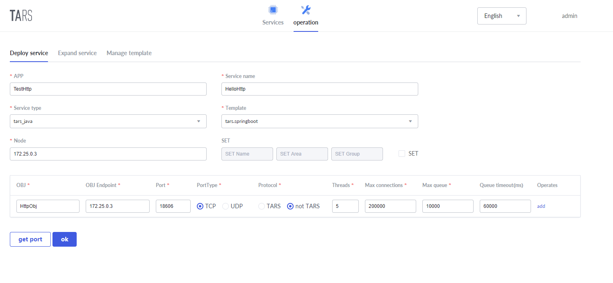
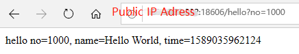

# HTTP Service Tutorials

## Function Description

The Tars platform supports the deployment of HTTP services. You can use the @TarsHttpService annotation to mark the service as an HTTP service. After the HTTP service is published to the platform, it can be called directly using the HTTP request.


## Demo

[tars-spring-boot-http-server](https://github.com/TarsCloud/TarsJava/tree/master/examples/tars-spring-boot-http-server)


## Service Development

### Project structure

```text
├── pom.xml
└── src
   └── main
       ├── java
       │   └── com.tecent.tars
       |       ├── App.java
       │       ├── client.testapp
       │       |   ├── HelloPrx.java
       │       |   └── HelloPrxCallback.java
       │       |
       |       └──http.server 
       │          └── HelloController.java
       └── resources
           └── hello.tars
```


### Dependency configuration

The following configuration needs to be added in pom.xml:

**Spring boot and Tars framework dependency**

```xml
  <parent>
    <groupId>org.springframework.boot</groupId>
    <artifactId>spring-boot-starter-parent</artifactId>
    <version>2.1.6.RELEASE</version>
  </parent>

  <dependencies>
    <dependency>
        <groupId>org.springframework.boot</groupId>
        <artifactId>spring-boot-starter-web</artifactId>
    </dependency>
    <dependency>
      <groupId>com.tencent.tars</groupId>
      <artifactId>tars-spring-boot-starter</artifactId>
      <version>1.7.0</version>
    </dependency>
  </dependencies>
```

**Plugin dependency**

```xml
<!--tars2java plugin-->
<plugin>
	<groupId>com.tencent.tars</groupId>
	<artifactId>tars-maven-plugin</artifactId>
	<version>1.7.0</version>
	<configuration>
		<tars2JavaConfig>
			<!-- tars file location -->
			<tarsFiles>
				<tarsFile>${basedir}/src/main/resources/hello.tars</tarsFile>
			</tarsFiles>
			<!-- Source file encoding -->
			<tarsFileCharset>UTF-8</tarsFileCharset>
			<!-- Generate server code -->
			<servant>false</servant>
			<!-- Generated source code encoding -->
			<charset>UTF-8</charset>
			<!-- Generated source code directory -->
			<srcPath>${basedir}/src/main/java</srcPath>
			<!-- Generated source code package prefix -->
			<packagePrefixName>com.tencent.tars.client.</packagePrefixName>
		</tars2JavaConfig>
	</configuration>
</plugin>
<!--package plugin-->
<plugin>
    <groupId>org.apache.maven.plugins</groupId>
    <artifactId>maven-jar-plugin</artifactId>
     <version>2.6</version>
     <configuration>
         <archive>
             <manifestEntries>
                 <Class-Path>conf/</Class-Path>
             </manifestEntries>
          </archive>
     </configuration>
</plugin>
<plugin>
    <groupId>org.springframework.boot</groupId>
    <artifactId>spring-boot-maven-plugin</artifactId>
    <configuration>
        <!--set mainclass-->
        <mainClass>com.tencent.tars.App</mainClass>
    </configuration>
    <executions>
        <execution>
            <goals>
                <goal>repackage</goal>
             </goals>
     </executions>
</plugin>
```


### Server interface file compilation

After the server service development is completed, we first need to obtain the client interface code of the server service. Copy the hello.tars file on the server side to the resources directory, and execute `mvn tars: tars2java` in the project root directory to get HelloPrx.java. At this time, the proxy interface of the server service is obtained, and three calling methods are provided, namely synchronous call, asynchronous call and promise call.

```java
@Servant
public interface HelloPrx {

	 String hello(int no, String name);

	CompletableFuture<String>  promise_hello(int no, String name);

	 String hello(int no, String name, @TarsContext java.util.Map<String, String> ctx);

	 void async_hello(@TarsCallback HelloPrxCallback callback, int no, String name);

	 void async_hello(@TarsCallback HelloPrxCallback callback, int no, String name, @TarsContext java.util.Map<String, String> ctx);
}
```


### Create controller

Then we need to create a controller. Create a new HelloController.java and use the @TarsHttpService annotation to enable the Tars HTTP service.

```java
@TarsHttpService("HttpObj")
@RestController
public class HelloController {
    @TarsClient("TestServer.HelloServer.HelloObj")
    HelloPrx helloPrx;

    @RequestMapping("/hello")
    public String testHello(@RequestParam Integer no){
        String ret = helloPrx.hello(no, "Hello World");
        return ret;
    }
}
```


### Tars service enabling

Finally, add @EnableTarsServer annotation in the spring boot startup class App to enable Tars service:

```java
@SpringBootApplication
@EnableTarsServer
public class App {
    public static void main( String[] args ){
        SpringApplication.run(App.class, args);
    }
}
```


### Service packaging

Using spring-boot-maven-plugin, execute `mvn package` in the root directory to package it into a jar.


## Service release

The process of HTTP service release is similar to that of [Tars service release](dev/tarsjava/tars-quick-start.md). The difference is that when the service is deployed, the protocol selects a non-TARS protocol. The specific settings are shown in the following figure:




## Service call

After the service is published successfully, you can call the service through http call. **Note that the IP address is the public IP, not the set internal IP**:

