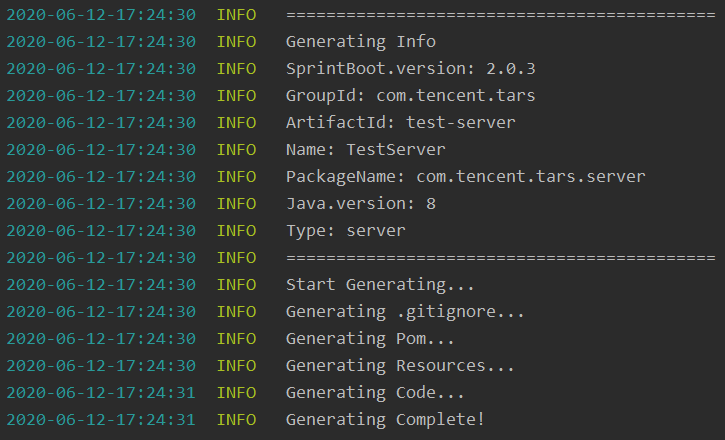

# TarsJava scaffolding tool
This tool provides TarsJava scaffolding.

With this tool, you can generate TarsJava scaffolding for the server and client, and quickly start the development of the Tars service.

## 1. Environmental requirements 
- JDK1.8 or above

## 2. Installation and usage
### Installation

Directly copy tars-java-tools-1.0.0.jar in the jar folder to the project directory and use it, or compile it yourself as follows:

- Clone the project: `git clone https://github.com/TarsCloud/TarsJavaStart.git`

  Environmental requirements 

  - JDK1.8 or above
  - Maven 3.5 or above

  - Spring Boot 2.1.3 or above

- Execute maven packaging in the project root directory: `mvn package`

- Enter the target directory and copy the generated jar package to the project directory

### Scaffolding generation

Run the following command in the project directory:

```text
java -jar tars-java-start-1.0.0.jar --springboot.version=2.0.3 --maven.group=com.tencent.tars --maven.artifact=test-server --maven.name=TestServer --packagename=com.tencent.tars.server --jdk.version=1.8 --type=server
```

The parameters are as follows:

- springboot.version: SpringBoot version, default is 2.0.3
- maven.group: maven groupId, default is com.tencent.tars
- maven.artifact: maven artifactId, default is test-server
- maven.name: maven Name, default is TestServer
- packagename: package name, default is com.tencent.tars.server
- jdk.version: jdk version, default is 1.8
- type: provide server and client options, default is server

After the command is executed, relevant information will be displayed. When 'Generating Complete!' appears, it means the generation is successful.




### Development and publishing

For server and client development, please refer to Tars-Spring-Boot Service Development in [Tars Service Tutorials](https://github.com/TarsCloud/TarsDocs_en/blob/master/dev/tarsjava/tars-tutorials.md). For publishing, please refer to the publishing process in [Quick Start To Tars](https://github.com/TarsCloud/TarsDocs_en/blob/master/dev/tarsjava/tars-quick-start.md).

