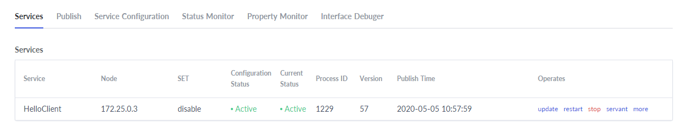
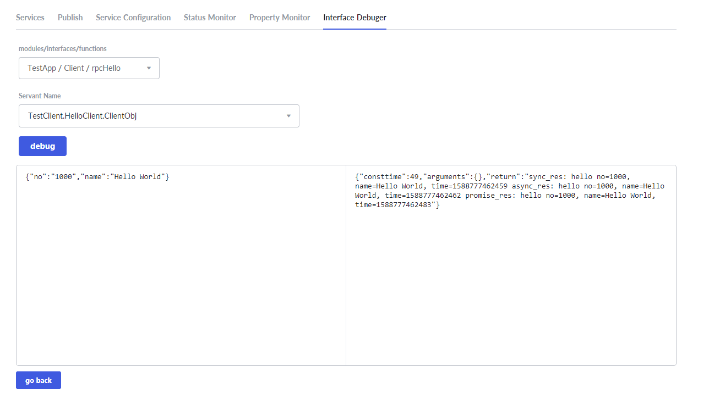

# Quick Start To Tars

This guide gives you a quick introduction to Tars in Java through simple server and client examples.

## Tars deployment by Docker

This guide uses Docker to complete the deployment of Tars.

### Docker installation

Taking Ubuntu for example, the installation process of Docker is as follows:

**1. Update package index**

```text
sudo apt-get update
```

**2. Allow installation via HTTPS**

```
sudo apt-get install  apt-transport-https  ca-certificates curl  software-properties-common
```

**3. Add Docker's official GPG key**

```
curl -fsSL  https://download.docker.com/linux/ubuntu/gpg | sudo apt-key add
```

Chinese users can use Tencent cloud source:

```text
curl -fsSL  https://mirrors.cloud.tencent.com/docker-ce/linux/ubuntu/gpg | sudo apt-key add -
```

**4. Set version library type**

```
sudo add-apt-repository "deb [arch=amd64]  https://download.docker.com/linux/ubuntu $(lsb_release -cs) stable" 
```

Chinese users can use Tencent cloud source:

```text
sudo add-apt-repository "deb [arch=amd64] https://mirrors.cloud.tencent.com/docker-ce/linux/ubuntu $(lsb_release -cs) stable" 
```

**5.  Update package index again**

```text
sudo apt-get update
```

**6. Install Docker-ce** 

```
sudo apt-get install docker-ce
```

**7. Test whether the installation is successful** 

```
docker run hello-world
```


The above interface appears to indicate that docker has been installed successfully.


### Tars deployment

**1. Create a Docker virtual network**

```text
# Create a bridge virtual network named tars with a gateway of 172.25.0.1 and a network segment of 172.25.0.0
docker network create -d bridge --subnet=172.25.0.0/16 --gateway=172.25.0.1 tars
```

**2. Start MySQL in Docker**

```text
docker run -d \
    --net=tars \
    -e MYSQL_ROOT_PASSWORD="123456" \
    --ip="172.25.0.2" \
    -v /data/framework-mysql:/var/lib/mysql \
    -v /etc/localtime:/etc/localtime \
    --name=tars-mysql \
    mysql:5.6
```

**3. Deploy using tarscloud/tars:java image**

Pull the container image:

```text
docker pull tarscloud/tars:java
```

Start the container:

```text
docker run -d -it --name tars_java \
    --net=tars \
    --env DBIP=172.25.0.2 \
    --env DBPort=3306 \
    --env DBUser=root \
    --env DBPassword=123456 \
    -e INET=eth0 \
    --ip="172.25.0.3" \
    -p 3000:3000 \
    -p 18600-18700:18600-18700 \
    -v /data/tars_data:/data \
    tarscloud/tars:java
```

**Note: - P 18600-18700:18600-18700 parameter opens 18600-18700 port for application. You can add more ports if necessary**


After the container is started, access `http://${your_machine_IP}:3000` to open the web management platform. The interface is as follows:


## Service release

### Download the example and package it into a jar

Run the following commands:

```text
# Clone the repository to get the example code:
git clone https://github.com/TarsCloud/TarsJava.git
# Enter server code directory
cd TarsJava/examples/tars-spring-boot-server
# package the server example into a jar
mvn package
# Enter client code directory
cd TarsJava/examples/tars-spring-boot-client
# package the client example into a jar
mvn package
```


### Service deployment

Enter the web management platform, select the operation tab and configure the server and client services respectively according to  the following figure. Some parameters are as follows:

- **Application Name**: a collection of services
- **Service Name**: the name of the process providing the service
- **OBJ**: interface which provides the specific service

The system defines the routing name of the service in the system through application name + service name + OBJ, for example, TestServer.HelloServer.HelloObj

- **Service type**: tars_java
- **Template**: tars.springboot
- **Node**: select the active Tars node IP
- **Port**: choose open ports

**server:**


**client:**


### Node publication

After the service is successfully deployed, you can see the two newly added services after refreshing the main page, namely the HelloServer service on the server side and the HelloClient service on the client side.


Select the HelloServer service and the HelloClient service respectively, switch to Publish tag, select the node to publish, and click the publish node button.


Click the upload release package button, and upload the jar.

**server:**


**client:**


After the upload is completed, a version number with a time stamp will be automatically generated. Select the version and click the publish button:

**server:**


**client:**


Back to the Services tab, you can see that the status is Active, which means success.

**server:**


**client:**




### Interface debugging

Switch to Interface Debugger tag，click the add button and upload the hello.tars file in the resources directory in the HelloServer service, and upload the client.tars file in the HelloClient service.

**server:**


**client:**


After the upload is completed, the newly added service will be displayed in the Tars file list.  Then click the debug button.

**server:**


**client:**


Select the function to be debugged, input the input parameter, and click the debug button to obtain the output parameter.

**server:**


**client:**



So far, the deployment of server and client is completed.
