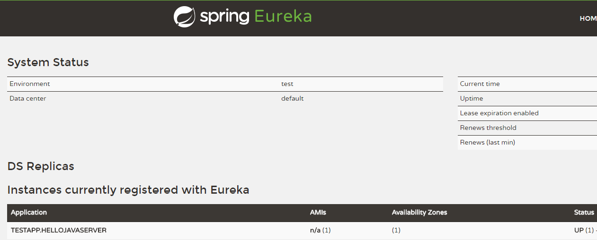

# Tars Service Tutorials

This tutorial provides Java developers with basic development guidelines for Spring, Spring Boot and Spring Cloud of Tars, including the following aspects:

- Add Tars dependency configuration.
- Define Tars interface file.
- Generate interface code using the tars-maven-plugin.
- Use Tars to write simple server and client services.


## Tars-Spring instructions

### Function Description

Tars supports the use of Spring to configure servant, which needs to depend on the tars-spring.jar package, as well as the spring 4 and above. You can use your servant as a Spring bean, and you can use the function of Spring freely. Finally, you only need to tell Tars which bean is servant through the label provided by the Tars.


### Demo

[tars-spring-server](https://github.com/TarsCloud/TarsJava/tree/master/examples/tars-spring-server) 


### Dependency configuration

Using this function requires adding a dependency jar package and adding the following configuration in pom.xml:

```xml
<dependency>
      <groupId>com.tencent.tars</groupId>
      <artifactId>tars-spring</artifactId>
      <version>1.6.1</version>
</dependency>
```


### Service exposure configuration

Using the spring configuration mode, you need to change the tars original configuration file servants.xml to servants-spring.xml under the resources directory.If all two configuration files exist, the spring mode will not be enabled if the servant.xml will be read first.

#### Servant configuration

In the Spring mode, servants-spring.xml is spring configuration file. The Tars's XSD file needs to be introduced first in the configuration file as follow:

```xml
<?xml version="1.0" encoding="UTF-8"?>
<beans xmlns="http://www.springframework.org/schema/beans"
       xmlns:xsi="http://www.w3.org/2001/XMLSchema-instance"
       xmlns:tars="http://tars.tencent.com/schema/tars"
       xsi:schemaLocation="
       http://www.springframework.org/schema/beans http://www.springframework.org/schema/beans/spring-beans-4.0.xsd
       http://tars.tencent.com/schema/tars http://tars.tencent.com/schema/tars/tars.xsd">
</beans>
```

Multiple spring tags are defined in Tars. When configuring servant, you need to define servant as a bean, and then define it as servant by  the Tars tag.

```xml
<tars:servant name="HelloObj" interface="com.qq.test.GreeterServant" ref="greeterServantImp"/>
<bean id="greeterServantImp" class="com.qq.test.impl.GreeterServantImp" />
```

The servant tag specifies the name of the servant through the name. Ref specifies the corresponding bean name, and interface specifies the corresponding interface name. Of course, you can also get bean by adding a @Component tag and then bean is obtained by spring automatic scanning, as well as configuring a corresponding bean name：

```xml
<context:component-scan base-package="com.qq.tars.test"/>
<tars:servant name="HelloObj" interface="com.qq.test.GreeterServant" ref="greeterServantImp"/>
```

#### Listener configuration

The configuration of listener is the same as that of the servant configuration, and you need to define your Listener as bean, and then the corresponding bean is specified as Listener through the Tars tag.

```xml
<tars:listener ref="startListener"/>
<bean id="startListener" class="com.qq.test.ServiceStartListener" />
```


### 1.3.0 Version update Guide

If you need new functions like tars-spring, you need to upgrade the tars to the 1.3.0 version and the above version. As the change is relatively large, the version update guide is as follows:

1. The management platform needs to be recompiled and upgraded.
2. Tars-node needs to be upgraded to a new version.
3. Modifying the classpath configuration item of the tars.tarsjava.default template in the template management to the following code:

> classpath=${basepath}/conf:${basepath}/WEB-INF/classes:${basepath}/WEB-INF/lib

4. When building a tars-java project, servants.xml needs to be placed under the resources directory.


## Tars-Spring-Boot instructions

### Function Description

Tars supports writing tars services using spring boot. To use this function, you need to rely on the tars-spring-boot-starter.jar package, and spring boot 2.0 or above. You can use your servant as a Spring bean, and the annotation exposes the spring bean.


### Demo

[tars-spring-boot-server](https://github.com/TarsCloud/TarsJava/tree/master/examples/tars-spring-boot-server) 

[tars-spring-boot-client](https://github.com/TarsCloud/TarsJava/tree/master/examples/tars-spring-boot-client) 


### Environmental requirements

- JDK1.8 or above

- Maven 3.5 or above

- Spring Boot 2.0 or above


### Server development

#### Project structure

```text
├── pom.xml
└── src
   └── main
       ├── java
       │   └── tars
       │       └── testapp
       │          ├── HelloServant.java
       │          ├── QuickStartApplication.java
       │          └── impl
       │                └── HelloServantImpl.java
       └── resources
           └── hello.tars
       
```


#### Dependency configuration

The following configuration needs to be added in pom.xml:

**Spring boot and Tars framework dependency**

```xml
    <properties>
        <spring-boot.version>2.0.3.RELEASE</spring-boot.version>
    </properties>

    <dependencyManagement>
        <dependencies>
            <dependency>
                <groupId>org.springframework.boot</groupId>
                <artifactId>spring-boot-dependencies</artifactId>
                <version>${spring-boot.version}</version>
                <type>pom</type>
                <scope>import</scope>
            </dependency>
        </dependencies>
    </dependencyManagement>

    <dependencies>
        <dependency>
            <groupId>com.tencent.tars</groupId>
            <artifactId>tars-spring-boot-starter</artifactId>
            <version>1.7.0</version>
        </dependency>
    </dependencies>
```

**Plugin dependency**

```xml
<!--tars2java plugin-->
<plugin>
	<groupId>com.tencent.tars</groupId>
	<artifactId>tars-maven-plugin</artifactId>
	<version>1.7.0</version>
	<configuration>
		<tars2JavaConfig>
			<!-- tars file location -->
			<tarsFiles>
				<tarsFile>${basedir}/src/main/resources/hello.tars</tarsFile>
			</tarsFiles>
			<!-- Source file encoding -->
			<tarsFileCharset>UTF-8</tarsFileCharset>
			<!-- Generate server code -->
			<servant>true</servant>
			<!-- Generated source code encoding -->
			<charset>UTF-8</charset>
			<!-- Generated source code directory -->
			<srcPath>${basedir}/src/main/java</srcPath>
			<!-- Generated source code package prefix -->
			<packagePrefixName>com.qq.tars.quickstart.server.</packagePrefixName>
		</tars2JavaConfig>
	</configuration>
</plugin>
<!--package plugin-->
<plugin>
    <groupId>org.apache.maven.plugins</groupId>
    <artifactId>maven-jar-plugin</artifactId>
     <version>2.6</version>
     <configuration>
         <archive>
             <manifestEntries>
                 <Class-Path>conf/</Class-Path>
             </manifestEntries>
          </archive>
     </configuration>
</plugin>
<plugin>
    <groupId>org.springframework.boot</groupId>
    <artifactId>spring-boot-maven-plugin</artifactId>
    <configuration>
        <!--set mainclass-->
        <mainClass>com.qq.tars.quickstart.server.QuickStartApplication</mainClass>
    </configuration>
    <executions>
        <execution>
            <goals>
                <goal>repackage</goal>
             </goals>
     </executions>
</plugin>
```


#### Service development

##### Tars interface file definition

Tars has its own interface file format. First, we need to define the Tars interface file. Create a new hello.tars file in the resources directory with the following content:

```text
module TestApp
{
	interface Hello
	{
	    string hello(int no, string name);
	};
};
```

##### Interface file compilation

Then we need to convert the Tars interface file to the server interface code using the tars-maven-plugin. In the project root directory, execute `mvn tars: tars2java` to get HelloServant.java, the content is as follows:

```java
@Servant
public interface HelloServant {

	public String hello(int no, String name);
}
```

##### Interface implementation

Next we need to implement the generated server interface. Create a new HelloServantImpl.java file, implement the HelloServant.java interface, and expose the service through the @TarsServant annotation, where 'HelloObj' is the servant name, corresponding to the name in the web management platform.

```java
@TarsServant("HelloObj")
public class HelloServantImpl implements HelloServant {

    @Override
    public String hello(int no, String name) {
        return String.format("hello no=%s, name=%s, time=%s", no, name, System.currentTimeMillis());
    }
}
```

##### Tars service enabling

Finally, add @EnableTarsServer annotation in the spring boot startup class QuickStartApplication to enable Tars service:

```java
@SpringBootApplication
@EnableTarsServer
public class QuickStartApplication {
    public static void main(String[] args) {
        SpringApplication.run(QuickStartApplication.class, args);
    }
}
```

##### Service packaging

Using spring-boot-maven-plugin, execute `mvn package` in the root directory to package it into a jar.


### Client development

#### Project structure

```text
├── pom.xml
└── src
   └── main
       ├── java
       │   └── tars
       │       └── testapp
       │          ├── HelloPrx.java
       │          ├── HelloPrxCallback.java
       │          ├── App.java
       │          └── impl
       │                └── ClientServantImpl.java
       └── resources
           ├── hello.tars
           └── client.tars
       
```


#### Dependency configuration

The following configuration needs to be added in pom.xml:

**Spring boot and Tars framework dependency**

```xml
    <properties>
        <spring-boot.version>2.0.3.RELEASE</spring-boot.version>
    </properties>

    <dependencyManagement>
        <dependencies>
            <dependency>
                <groupId>org.springframework.boot</groupId>
                <artifactId>spring-boot-dependencies</artifactId>
                <version>${spring-boot.version}</version>
                <type>pom</type>
                <scope>import</scope>
            </dependency>
        </dependencies>
    </dependencyManagement>

    <dependencies>
        <dependency>
            <groupId>com.tencent.tars</groupId>
            <artifactId>tars-spring-boot-starter</artifactId>
            <version>1.7.0</version>
        </dependency>
    </dependencies>
```

**Plugin dependency**

```xml
<!--tars2java plugin-->
<plugin>
	<groupId>com.tencent.tars</groupId>
	<artifactId>tars-maven-plugin</artifactId>
	<version>1.7.0</version>
	<configuration>
		<tars2JavaConfig>
			<!-- tars file location -->
			<tarsFiles>
				<tarsFile>${basedir}/src/main/resources/hello.tars</tarsFile>
			</tarsFiles>
			<!-- Source file encoding -->
			<tarsFileCharset>UTF-8</tarsFileCharset>
			<!-- Generate server code -->
			<servant>false</servant>
			<!-- Generated source code encoding -->
			<charset>UTF-8</charset>
			<!-- Generated source code directory -->
			<srcPath>${basedir}/src/main/java</srcPath>
			<!-- Generated source code package prefix -->
			<packagePrefixName>com.tencent.tars.client.</packagePrefixName>
		</tars2JavaConfig>
	</configuration>
</plugin>
<!--package plugin-->
<plugin>
    <groupId>org.apache.maven.plugins</groupId>
    <artifactId>maven-jar-plugin</artifactId>
     <version>2.6</version>
     <configuration>
         <archive>
             <manifestEntries>
                 <Class-Path>conf/</Class-Path>
             </manifestEntries>
          </archive>
     </configuration>
</plugin>
<plugin>
    <groupId>org.springframework.boot</groupId>
    <artifactId>spring-boot-maven-plugin</artifactId>
    <configuration>
        <!--set mainclass-->
        <mainClass>com.tencent.tars.App</mainClass>
    </configuration>
    <executions>
        <execution>
            <goals>
                <goal>repackage</goal>
             </goals>
     </executions>
</plugin>
```


#### Service development

##### Server interface file compilation

After the server service development is completed, we first need to obtain the client interface code of the server service. Copy the hello.tars file on the server side to the resources directory, and execute `mvn tars: tars2java` in the project root directory to get HelloPrx.java. At this time, the proxy interface of the server service is obtained, and three calling methods are provided, namely synchronous call, asynchronous call and promise call.

```java
@Servant
public interface HelloPrx {

	 String hello(int no, String name);

	CompletableFuture<String>  promise_hello(int no, String name);

	 String hello(int no, String name, @TarsContext java.util.Map<String, String> ctx);

	 void async_hello(@TarsCallback HelloPrxCallback callback, int no, String name);

	 void async_hello(@TarsCallback HelloPrxCallback callback, int no, String name, @TarsContext java.util.Map<String, String> ctx);
}
```

The promise call is a new feature of Tars v1.7.0. For specific use, please refer to the [Tars file reference](./tars-reference.md).

##### Client interface file definition

Then define the interface file of the client service. Create a new client.tars file in the resources directory with the following content:

```text
module TestApp
{
	interface Client
	{
	    string rpcHello(int no, string name);
	};
};
```

##### Client interface file compilation

Next, we need to use the tars-maven-plugin to generate client service interface code. Modify the tars2java plugin dependency of pom.xml as follows. Note that `<servant> </ servant>` is set to true.

```xml
<!--tars2java plugin-->
<plugin>
	<groupId>com.tencent.tars</groupId>
	<artifactId>tars-maven-plugin</artifactId>
	<version>1.7.0</version>
	<configuration>
		<tars2JavaConfig>
			<!-- tars file location -->
			<tarsFiles>
				<tarsFile>${basedir}/src/main/resources/client.tars</tarsFile>
			</tarsFiles>
			<!-- Source file encoding -->
			<tarsFileCharset>UTF-8</tarsFileCharset>
			<!-- Generate server code -->
			<servant>true</servant>
			<!-- Generated source code encoding -->
			<charset>UTF-8</charset>
			<!-- Generated source code directory -->
			<srcPath>${basedir}/src/main/java</srcPath>
			<!-- Generated source code package prefix -->
			<packagePrefixName>com.tencent.tars.client.</packagePrefixName>
		</tars2JavaConfig>
	</configuration>
</plugin>
```

In the root directory of the project, execute `mvn tars: tars2java` again to get ClientServant.java. The contents are as follows:

```java
@Servant
public interface ClientServant {
    public String rpcHello(int no, String name);
}
```

##### Interface implementation

We need to implement the generated client service interface. Create a new ClientServantImpl.java file, implement the HelloServant.java interface, and expose the service through the @TarsServant annotation, where 'HelloObj' is the servant name, corresponding to the name in the web management platform.

By adding the @TarsClient annotation to the client properties, the corresponding service can be automatically injected. If only the Obj name is filled, the default value is used to inject the client. In addition, the client configuration can be customized in the annotation, such as setting the synchronous call timeout time.

```java
@TarsServant("ClientObj")
public class ClientServantImpl implements ClientServant {
    @TarsClient("TestServer.HelloServer.HelloObj")
    HelloPrx helloPrx;

    String res = "";

    @Override
    public String rpcHello(int no, String name) {
        //sync call
        String syncres = helloPrx.hello(1000, "Hello World");
        res += "sync_res: " + syncres + " ";
        //async call
        helloPrx.async_hello(new HelloPrxCallback() {

            @Override
            public void callback_expired() {
            }

            @Override
            public void callback_exception(Throwable ex) {
            }

            @Override
            public void callback_hello(String ret) {
                res += "async_res: " + ret + " ";

            }
        }, 1000, "HelloWorld");
        //promise call
        helloPrx.promise_hello(1000, "hello world").thenCompose(x -> {
            res += "promise_res: " + x;
            return CompletableFuture.completedFuture(0);
        });
        return res;
    }
}

```

Configuration provided by annotation:

```java
@Target({ ElementType.FIELD })
@Retention(RetentionPolicy.RUNTIME)
@Documented
public @interface TarsClient {
    @AliasFor("name")
    String value() default "";

    @AliasFor("value")
    String name() default "";

    String setDivision() default "";

    int connections() default Constants.default_connections;

    int connectTimeout() default Constants.default_connect_timeout;

    int syncTimeout() default Constants.default_sync_timeout;

    int asyncTimeout() default Constants.default_async_timeout;

    boolean enableSet() default false;

    boolean tcpNoDelay() default false;

    String charsetName() default "UTF-8";
}
```

##### Tars service enabling

Finally, add @EnableTarsServer annotation in the spring boot startup class App to enable Tars service:

```java
@SpringBootApplication
@EnableTarsServer
public class App {
    public static void main( String[] args ){
        SpringApplication.run(App.class, args);
    }
}
```

##### Service packaging

Using spring-boot-maven-plugin, execute `mvn package` in the root directory to package it into a jar.

 

## Tars Spring-Cloud instructions

### Function description

Tars-java is compatible with the Spring Cloud system, users can integrate the Tars-java into Spring Cloud.


### Demo

[Spring Cloud Server](https://github.com/TarsCloud/TarsJava/tree/master/examples/tars-spring-cloud-server) 

[Spring Cloud Client](https://github.com/TarsCloud/TarsJava/tree/master/examples/tars-spring-cloud-client)


### Environmental dependence

The following requirements should be met before operation.

- JDK 1.8 or above.

- If you want to use the discovery feature, you need an Eureka Server instance that has already run Spring Cloud. For details on how to start the configuration, please refer to the Spring Cloud related tutorial.


### Service release

Here are the steps to create and publish a service:

- First, create a maven project and add dependency configuration to the project's pom.xml:

```xml
<dependency>
    <groupId>com.tencent.tars</groupId>
    <artifactId>tars-spring-cloud-starter</artifactId>
    <version>1.6.1</version>
</dependency>
```

- Write the Tars file and generate the server interface code. For the specific operation process, please refer to the service development part of the tars_java_quickstart.md document:

```java
@Servant
public interface HelloServant {

	public String hello(int no, String name);          
}
```

- After the interface code is generated, the interface needs to be implemented. Then add the @TarsServant annotation to the entire implementation class, indicating that the modified class is a Tars Servant, don't forget to identify the Servant name in the annotation as the client calls the Servant identifier. According to the Tars specification, the servant name should end with "Obj":

```java
@TarsServant(name="HelloObj")
public class HelloServantImpl implements HelloServant {

    @Override
    public String hello(int no, String name) {
        return String.format("hello no=%s, name=%s, time=%s", no, name,     System.currentTimeMillis());
    }
}
```

- Write the startup-class of service, using the spring boot startup method, and indicate that this is a Tars-java service by annotating @EnableTarsConfiguration and try to register the service into the Spring Cloud:

```java
@SpringBootApplication
@EnableTarsConfiguration
public class Application {


    public static void main(String[] args) {
        SpringApplication.run(Application.class, args);
    }
}
```

- To write a Spring Cloud configuration file, you need to specify the address of the service registry and the information of the service itself in the configuration file. Create the configuration file application.yml in the resources directory. The example is as follows:

```yml
eureka:
  client:
    serviceUrl:
      #Service registry address
	  defaultZone: http://localhost:8761/eureka/

#The configuration under this tab is unique to Tars-java
tars:    
  #Server configuration
  server:
    #Server port
    port: 18601 
    #Application name, The specific meaning refers to the service naming chapter of tars_java_quickstart.md
    application: TestApp
    #Server name, The specific meaning refers to the service naming chapter of tars_java_quickstart.md
    server-name: HelloJavaServer
    #Specify the service log path, whichever is the case
    log-path: /usr/local/tars-eureka-test/bin/log
    #Specify data file path, whichever is the case
    data-path: /usr/local/tars-eureka-test/data
  #Client configuration
  client:
    async-invoke-timeout: 10000
    #Service discovery center address, generally the same as the registration center address, can be left blank
    locator: http://localhost:8761/eureka/
```

- Start the Application class, open the registry address [http://localhost:8761](http://localhost:8761/)(Based on your actual situation, this is the default address of Eureka), you can see that the Tars service is already registered on Eureka:



 TESTAPP.HELLOJAVASERVER is the service we just registered, where TESTAPP corresponds to the application name in the configuration file(attributes corresponding to tars.server.application), HELLOJAVASERVER corresponds to the server name in the configuration file(attributes corresponding to tars.server.server-name). The name registered on Eureka is the application name of the configuration file plus the service name, separated by a '.'. The service name displayed on the Eureka page is all uppercase, but it is actually the name filled in our configuration file.
 Eureka.

So far, a service has been developed.


### Access service

Here's how to discover and access a service.

- First create a maven project and add the following dependency configuration to the project's pom.xml file:

```xml
<dependency>
    <groupId>com.tencent.tars</groupId>
    <artifactId>tars-spring-cloud-starter</artifactId>
    <version>1.6.1</version>
</dependency>
```


- Use the Tars file on the server to generate the client access interface. For details, refer to the client development part of the tars_java_quickstart.md file:


```java
@Servant
public interface HelloPrx {

	 String hello(int no, String name);

	 String hello(int no, String name, @TarsContext java.util.Map<String, String> ctx);

	 void async_hello(@TarsCallback HelloPrxCallback callback, int no, String name);

	 void async_hello(@TarsCallback HelloPrxCallback callback, int no, String name, @TarsContext java.util.Map<String, String> ctx);
}
```

- Write a startup class that uses spring boot as the startup method:

```java
@SpringBootApplication
public class Application {
    public static void main(String[] args) {
        SpringApplication.run(Application.class, args);
        //use service...
    }
}
```

- Write the configuration file application.yml and add the master related information:

```
eureka:
  client:
    serviceUrl:
      #Service center address
      defaultZone: http://localhost:8761/eureka/
      #The client does not need to register with the spring cloud master
      register-with-eureka: false
```

  ​

- By annotating @TarsClient to make the system automatically load clients to access the interface, you need to specify the name of the Obj object to be accessed by the name attribute of the annotation. The name consists of the application name + "." + service name + "." + servant name. The name in the example is the servant registered by the service above. The class holding the variable needs to be registered as a spring bean:

```java
@Component
public class Client {
    @TarsClient(name = "TestApp.HelloJavaServer.HelloObj")
    private HelloPrx proxy;
}
```

- Call target method


```java
proxy.hello(10, "hello");
```

