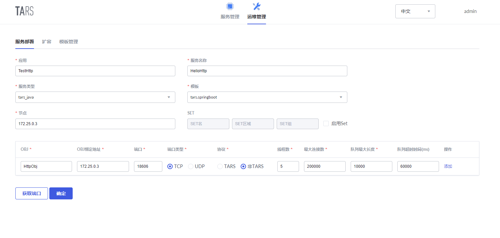

# Tars HTTP服务开发教程

## 功能说明

Tars平台支持HTTP服务的部署，使用@TarsHttpService注解即可将服务标记为HTTP服务。HTTP服务发布到平台后可以直接使用http请求来调用。


## 示例工程

[tars-spring-boot-http-server](https://github.com/TarsCloud/TarsJava/tree/master/examples/tars-spring-boot-http-server)


## 服务开发

### 工程目录

```text
├── pom.xml
└── src
   └── main
       ├── java
       │   └── com.tecent.tars
       |       ├── App.java
       │       ├── client.testapp
       │       |   ├── HelloPrx.java
       │       |   └── HelloPrxCallback.java
       │       |
       |       └──http.server 
       │          └── HelloController.java
       └── resources
           └── hello.tars
```


### 依赖配置

在pom.xml文件中需要添加如下配置:

**Spring Boot及Tars框架依赖**

```xml
  <parent>
    <groupId>org.springframework.boot</groupId>
    <artifactId>spring-boot-starter-parent</artifactId>
    <version>2.1.6.RELEASE</version>
  </parent>

  <dependencies>
    <dependency>
        <groupId>org.springframework.boot</groupId>
        <artifactId>spring-boot-starter-web</artifactId>
    </dependency>
    <dependency>
      <groupId>com.tencent.tars</groupId>
      <artifactId>tars-spring-boot-starter</artifactId>
      <version>2.0.0</version>
    </dependency>
  </dependencies>
```

**插件依赖**

```xml
<!--tars2java插件-->
<plugin>
	<groupId>com.tencent.tars</groupId>
	<artifactId>tars-maven-plugin</artifactId>
	<version>2.0.0</version>
	<configuration>
		<tars2JavaConfig>
			<!-- tars文件位置 -->
			<tarsFiles>
				<tarsFile>${basedir}/src/main/resources/hello.tars</tarsFile>
			</tarsFiles>
			<!-- 源文件编码 -->
			<tarsFileCharset>UTF-8</tarsFileCharset>
			<!-- 生成服务端代码 -->
			<servant>false</servant>
			<!-- 生成源代码编码 -->
			<charset>UTF-8</charset>
			<!-- 生成的源代码目录 -->
			<srcPath>${basedir}/src/main/java</srcPath>
			<!-- 生成源代码包前缀 -->
			<packagePrefixName>com.tencent.tars.client.</packagePrefixName>
		</tars2JavaConfig>
	</configuration>
</plugin>
<!--打包插件-->
<plugin>
    <groupId>org.apache.maven.plugins</groupId>
    <artifactId>maven-jar-plugin</artifactId>
     <version>2.6</version>
     <configuration>
         <archive>
             <manifestEntries>
                 <Class-Path>conf/</Class-Path>
             </manifestEntries>
          </archive>
     </configuration>
</plugin>
<plugin>
    <groupId>org.springframework.boot</groupId>
    <artifactId>spring-boot-maven-plugin</artifactId>
    <configuration>
        <!--设置打包主类-->
        <mainClass>com.tencent.tars.App</mainClass>
    </configuration>
    <executions>
        <execution>
            <goals>
                <goal>repackage</goal>
             </goals>
     </executions>
</plugin>
```


### 服务开发

#### 使用插件生成服务端服务接口代码

服务端服务开发完成后，在客户端我们首先需要获得服务端服务的客户端接口代码。将服务端的hello.tars文件复制到resources目录下，并在工程根目录下，执行mvn tars:tars2java，即可得到HelloPrx.java。此时得到的是服务端服务的代理接口，并且提供了三种调用方式，分别为同步调用、异步调用和promise调用，具体内容如下：

```java
@Servant
public interface HelloPrx {

	 String hello(int no, String name);

	CompletableFuture<String>  promise_hello(int no, String name);

	 String hello(int no, String name, @TarsContext java.util.Map<String, String> ctx);

	 void async_hello(@TarsCallback HelloPrxCallback callback, int no, String name);

	 void async_hello(@TarsCallback HelloPrxCallback callback, int no, String name, @TarsContext java.util.Map<String, String> ctx);
}
```


#### 编写Controller

之后，编写Controller类来实现控制器。新建HelloController.java，并使用@TarsHttpService注解开启Tars HTTP服务。

```java
@TarsHttpService("HttpObj")
@RestController
public class HelloController {
    @TarsClient("TestServer.HelloServer.HelloObj")
    HelloPrx helloPrx;

    @RequestMapping("/hello")
    public String testHello(@RequestParam Integer no){
        String ret = helloPrx.hello(no, "Hello World");
        return ret;
    }
}
```


#### 开启Tars服务

最后，在Spring Boot启动类App中添加@EnableTarsServer注解来开启Tars服务：

```java
@SpringBootApplication
@EnableTarsServer
public class App {
    public static void main( String[] args ){
        SpringApplication.run(App.class, args);
    }
}
```


#### 服务打包

通过spring-boot-maven-plugin，在根目录下执行mvn package即可打包为jar包进行部署。


## 服务发布

HTTP服务发布的的流程和[Tars服务发布](dev/tarsjava/tars-quick-start.md)的流程类似，区别在于服务部署的时候，协议选择非TARS协议，具体设置如下图所示：




## 服务调用

服务发布成功之后，即可通过http调用的方式来调用该服务，**注意IP地址为公网IP，非设置的内网的IP**：

