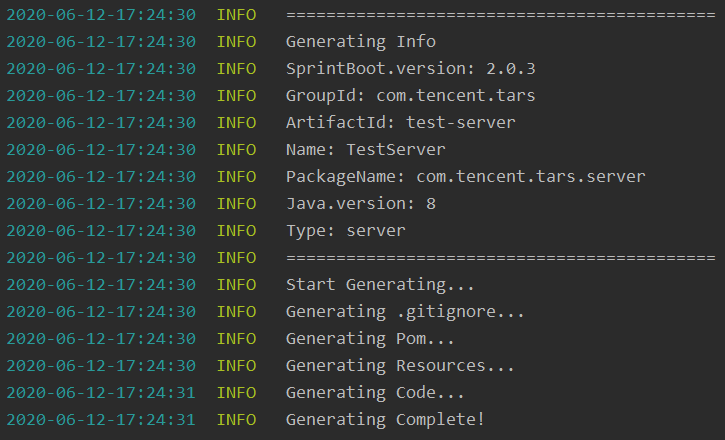

# TarsJava脚手架自动生成工具  
此工具提供了TarsJava脚手架自动生成的功能。  

通过此工具，可以生成服务端和客户端的TarsJava脚手架，快速开始Tars服务的开发。

## 1. 环境需求  
- JDK 1.8或以上版本

## 2. 安装与使用
### 安装

直接将jar文件夹下的tars-java-tools-1.0.0.jar复制至工程目录即可使用，也可以按照如下步骤自行编译：

- 将项目克隆至本地：`git clone https://github.com/TarsCloud/TarsJavaStart.git`

  环境需求：

  - JDK 1.8或以上版本
  - Maven 3.5或以上版本
  - Spring Boot 2.1.3或以上版本

- 在项目根目录下执行maven打包：`mvn package`

- 进入target目录后，将生成的jar包拷贝至工程目录

### 脚手架生成  

在工程目录执行如下命令：

```text
java -jar tars-java-start-1.0.0.jar --springboot.version=2.0.3 --maven.group=com.tencent.tars --maven.artifact=test-server --maven.name=TestServer --packagename=com.tencent.tars.server --jdk.version=1.8 --type=server
```

其中的参数为：

- springboot.version：SpringBoot版本，默认值为2.0.3
- maven.group：maven的项目groupId，默认值为com.tencent.tars
- maven.artifact：maven项目的artifactId，默认值为test-server
- maven.name：maven项目的Name，默认值为TestServer
- packagename：生成的包名，默认值为com.tencent.tars.server
- jdk.version：jdk版本，默认值为1.8
- type：生成服务端/客户端脚手架，提供server和client选项，默认值为server

命令执行后，会显示相关信息，出现Generating Complete则表示生成成功。




### 开发与发布  
服务端和客户端的开发可以参考[Tars服务开发指南](https://github.com/TarsCloud/TarsDocs/blob/master/dev/tarsjava/tars-tutorials.md)中的Tars-Spring-Boot服务开发，发布可参考[Tars快速入门](https://github.com/TarsCloud/TarsDocs/blob/master/dev/tarsjava/tars-quick-start.md)中的发布流程。
