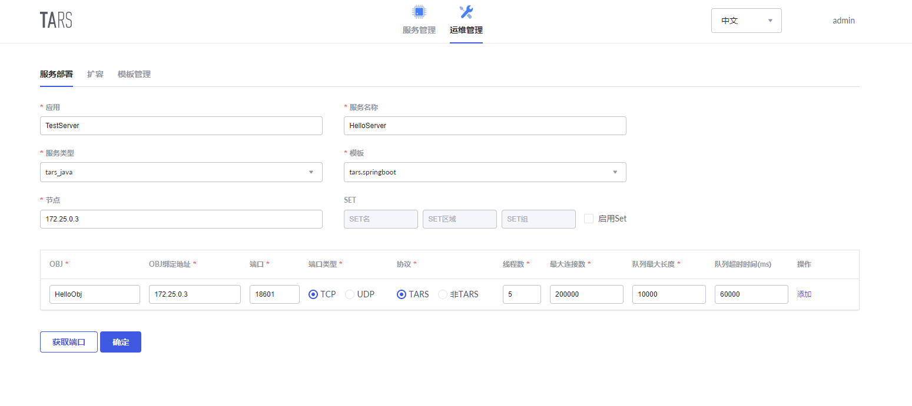
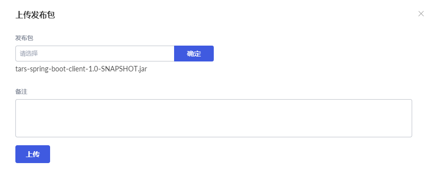

# Tars快速入门

本指南通过简单的服务端和客户端示例，使您快速入门Java中的Tars。

## Docker部署Tars

本指南主要采用 Docker 来完成Tars的部署。

### 安装Docker

ubuntu上安装docker流程如下：

**1. 更新包索引**

```text
sudo apt-get update
```

**2. 允许通过https安装**

```
sudo apt-get install  apt-transport-https  ca-certificates curl  software-properties-common
```

**3. 添加Docker官方的GPG密钥：**

```
curl -fsSL  https://download.docker.com/linux/ubuntu/gpg | sudo apt-key add
```

国内用户可使用腾讯云源：

```text
curl -fsSL https://mirrors.cloud.tencent.com/docker-ce/linux/ubuntu/gpg | sudo apt-key add -
```

**4. 设置版本库类型**

```
sudo add-apt-repository "deb [arch=amd64]  https://download.docker.com/linux/ubuntu $(lsb_release -cs) stable" 
```

国内用户可使用腾讯云源：

```text
sudo add-apt-repository "deb [arch=amd64] https://mirrors.cloud.tencent.com/docker-ce/linux/ubuntu $(lsb_release -cs) stable" 
```

**5. 再次更新包索引**

```text
sudo apt-get update
```

**6. 安装docker-ce** 

```
sudo apt-get install docker-ce
```

**7. 测试是否安装成功** 

```
docker run hello-world
```


出现如上界面表示docker安装成功。


### 部署Tars

**1. 创建Docker虚拟网络**

```text
# 创建一个名为tars的桥接(bridge)虚拟网络，网关172.25.0.1，网段为172.25.0.0
docker network create -d bridge --subnet=172.25.0.0/16 --gateway=172.25.0.1 tars
```

**2. Docker中启动MySQL**

```text
docker run -d \
    --net=tars \
    -e MYSQL_ROOT_PASSWORD="123456" \
    --ip="172.25.0.2" \
    -v /data/framework-mysql:/var/lib/mysql \
    -v /etc/localtime:/etc/localtime \
    --name=tars-mysql \
    mysql:5.6
```

**3. 使用tarscloud/tars:java部署**

拉取容器镜像：

```text
docker pull tarscloud/tars:java
```

启动容器：

```text
docker run -d -it --name tars_java \
    --net=tars \
    --env DBIP=172.25.0.2 \
    --env DBPort=3306 \
    --env DBUser=root \
    --env DBPassword=123456 \
    -e INET=eth0 \
    --ip="172.25.0.3" \
    -p 3000:3000 \
    -p 18600-18700:18600-18700 \
    -v /data/tars_data:/data \
    tarscloud/tars:java
```

**注意：-p 18600-18700:18600-18700参数开放了 18600-18700 端口供应用使用，不够可自行添加。**


容器启动后， 访问 `http://${你的机器IP}:3000` 即可打开 web管理平台，界面如下：


## 服务发布

### 下载示例并打包

依次执行以下命令：

```text
# 克隆示例代码
git clone https://github.com/TarsCloud/TarsJava.git
# 进入服务端目录
cd TarsJava/examples/tars-spring-boot-server
# 打包服务端服务为jar包
mvn package
# 进入客户端目录
cd TarsJava/examples/tars-spring-boot-client
# 打包客户端服务为jar包
mvn package
```


### 服务部署

 进入web管理平台，选择运维管理标签，分别对服务端和客户端服务如下图进行配置，一些参数如下：

- 应用名：表示一组服务的集合
- 服务名称：提供服务的进程名称
- OBJ：提供具体服务的接口

系统通过应用名+服务名称+OBJ来定义服务在系统中的路由名称，例如TestServer.HelloServer.HelloObj

- 服务类型：tars_java
- 模板：tars.springboot
- 节点：选择启动的Tars节点IP
- 端口：选择对外开放的端口

之后点击确定即可进行服务部署。

**服务端：**



**客户端：**


### 发布节点

服务部署成功后，刷新主页面后可以看到新增的两个服务，分别为服务端的HelloServer服务和客户端的HelloClient服务。


分别选择服务端和客户端服务，进入发布管理，选中需要发布的节点，点击发布选中节点。


之后点击上传发布包，并把对应的jar包上传。

**服务端：**


**客户端：**




上传完成后，会自动生成一个带有时间戳的版本号，选择该版本，点击发布。

**服务端：**


**客户端：**


发布成功后，回到服务管理界面可以看到当前状态为Active，即表示成功。

**服务端：**


**客户端：**


### 接口调试

进入接口调试界面，点击添加，在HelloServer服务中上传resources目录下的hello.tars文件，在HelloClient服务中上传client.tars文件。

**服务端：**


**客户端：**


上传完成后，在tars文件列表中会显示新增的服务，点击调试。

**服务端：**


**客户端：**


选择需要调试的方法，并输入入参，点击调试，即可获得方法出参。

**服务端：**


**客户端：**


至此，服务端和客户端部署完毕。

