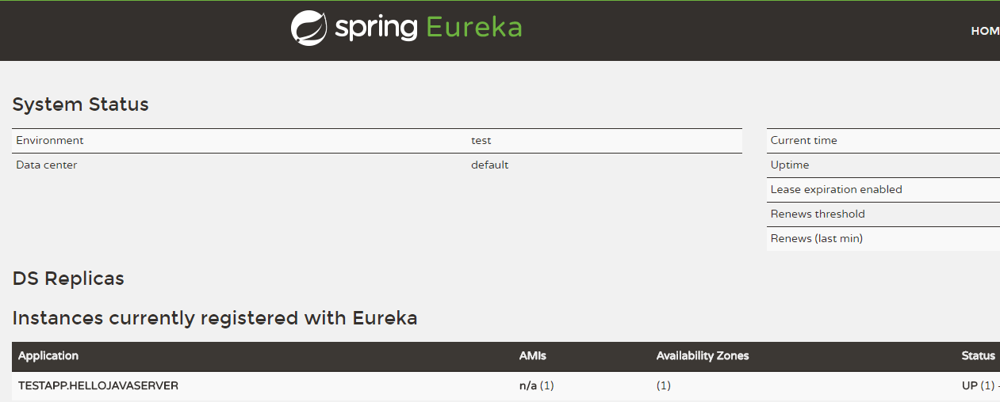

# Tars服务开发教程

本教程为Java开发者提供了Tars的Spring、Spring Boot以及Spring Cloud的基本开发指南，主要包括以下几个方面：

- 添加Tars依赖配置
- 定义Tars接口文件
- 使用Tars插件生成接口代码
- 使用Tars编写简单的服务端和客户端服务


## Tars-Spring 使用说明

### 功能说明

Tars支持使用Spring配置servant，使用此功能需要依赖tars-spring.jar包，以及spring 4及以上版本。你可以将你的servant作为一个Spring bean，你可以自由的使用Spring的功能最后只需要通过Tars提供的标签告知Tars哪些些bean是servant即可。


### 示例工程

[tars-spring-server](https://github.com/TarsCloud/TarsJava/tree/master/examples/tars-spring-server)


### 依赖配置

使用此功能需要添加依赖jar包，在pom.xml中添加如下配置：

```text
<dependency>
      <groupId>com.tencent.tars</groupId>
      <artifactId>tars-spring</artifactId>
      <version>1.7.0</version>
</dependency>
```


### 服务暴露配置

使用spring配置模式需要在resources目录下将tars原版配置文件servants.xml改为servants-spring.xml，如果两种配置文件均存在会优先读取servant.xml则不会启用spring模式。


#### Servant配置

在Spring模式下，servants-spring.xml为spring配置文件，在配置文件中需要先引入Tars的xsd文件：

```text
<?xml version="1.0" encoding="UTF-8"?>
<beans xmlns="http://www.springframework.org/schema/beans"
       xmlns:xsi="http://www.w3.org/2001/XMLSchema-instance"
       xmlns:tars="http://tars.tencent.com/schema/tars"
       xsi:schemaLocation="
       http://www.springframework.org/schema/beans http://www.springframework.org/schema/beans/spring-beans-4.0.xsd
       http://tars.tencent.com/schema/tars http://tars.tencent.com/schema/tars/tars.xsd">
</beans>
```

Tars中自定义了多个spring标签，配置servant时需要先将servant定义为一个bean，然后通过Tars标签定义为servant：

```text
<tars:servant name="HelloObj" interface="com.qq.test.GreeterServant" ref="greeterServantImp"/>
<bean id="greeterServantImp" class="com.qq.test.impl.GreeterServantImp" />
```

servant标签通过name指定servant名称，ref指定对应的bean名，通过interface指定对应的接口名。当然你也可以通过添加@Component标签然后通过spring自动扫描获取到bean，同样只需要配置对应bean名即可：

```text
<context:component-scan base-package="com.qq.tars.test"/>
<tars:servant name="HelloObj" interface="com.qq.test.GreeterServant" ref="greeterServantImp"/>
```


#### Listener配置

listener的配置与servant配置相同，也需要将你的Listener定义为bean，然后通过tars标签将对应的bean指定为Listener：

```text
<tars:listener ref="startListener"/>
<bean id="startListener" class="com.qq.test.ServiceStartListener" />
```


### 1.3.0版本升级指南

如需使用tars-spring等新功能需要将tars升级到1.3.0版本及以上版本，本次改动相对较大，附上版本升级指南：

1. 管理平台需要重新编译升级。
2. tars-node需要升级到新版本。
3. 在模版管理中修改tars.tarsjava.default模版的classpath配置项，修改为

> classpath=${basepath}/conf:${basepath}/WEB-INF/classes:${basepath}/WEB-INF/lib

1. 在构建tars-java项目时servants.xml需要放在resources目录下


## Tars-Spring-Boot服务开发

### 功能说明

Tars支持使用通过spring boot的方式编写Tars服务，使用此功能需要依赖tars-spring-boot-starter.jar包，以及Spring Boot 2.0及以上版本。你可以将你的servant作为一个Spring bean，注解暴露spring bean即可。


### 示例工程

[tars-spring-boot-server](https://github.com/TarsCloud/TarsJava/tree/master/examples/tars-spring-boot-server)

[tars-spring-boot-client](https://github.com/TarsCloud/TarsJava/tree/master/examples/tars-spring-boot-client)


### 环境需求

- JDK 1.8或以上版本
- Maven 3.5或以上版本
- Spring Boot 2.0或以上版本


### 服务端开发

#### 工程目录

```text
├── pom.xml
└── src
   └── main
       ├── java
       │   └── tars
       │       └── testapp
       │          ├── HelloServant.java
       │          ├── QuickStartApplication.java
       │          └── impl
       │                └── HelloServantImpl.java
       └── resources
           └── hello.tars
       
```


#### 依赖配置

在pom.xml文件中需要添加如下配置:

**spring boot及框架依赖**

```xml
    <properties>
        <spring-boot.version>2.0.3.RELEASE</spring-boot.version>
    </properties>

    <dependencyManagement>
        <dependencies>
            <dependency>
                <groupId>org.springframework.boot</groupId>
                <artifactId>spring-boot-dependencies</artifactId>
                <version>${spring-boot.version}</version>
                <type>pom</type>
                <scope>import</scope>
            </dependency>
        </dependencies>
    </dependencyManagement>

    <dependencies>
        <dependency>
            <groupId>com.tencent.tars</groupId>
            <artifactId>tars-spring-boot-starter</artifactId>
            <version>1.7.0</version>
        </dependency>
    </dependencies>
```

**插件依赖**

```xml
<!--tars2java插件-->
<plugin>
	<groupId>com.tencent.tars</groupId>
	<artifactId>tars-maven-plugin</artifactId>
	<version>1.7.0</version>
	<configuration>
		<tars2JavaConfig>
			<!-- tars文件位置 -->
			<tarsFiles>
				<tarsFile>${basedir}/src/main/resources/hello.tars</tarsFile>
			</tarsFiles>
			<!-- 源文件编码 -->
			<tarsFileCharset>UTF-8</tarsFileCharset>
			<!-- 生成服务端代码 -->
			<servant>true</servant>
			<!-- 生成源代码编码 -->
			<charset>UTF-8</charset>
			<!-- 生成的源代码目录 -->
			<srcPath>${basedir}/src/main/java</srcPath>
			<!-- 生成源代码包前缀 -->
			<packagePrefixName>com.qq.tars.quickstart.server.</packagePrefixName>
		</tars2JavaConfig>
	</configuration>
</plugin>
<!--打包插件-->
<plugin>
    <groupId>org.apache.maven.plugins</groupId>
    <artifactId>maven-jar-plugin</artifactId>
     <version>2.6</version>
     <configuration>
         <archive>
             <manifestEntries>
                 <Class-Path>conf/</Class-Path>
             </manifestEntries>
          </archive>
     </configuration>
</plugin>
<plugin>
    <groupId>org.springframework.boot</groupId>
    <artifactId>spring-boot-maven-plugin</artifactId>
    <configuration>
        <!--设置打包主类-->
        <mainClass>com.qq.tars.quickstart.server.QuickStartApplication</mainClass>
    </configuration>
    <executions>
        <execution>
            <goals>
                <goal>repackage</goal>
             </goals>
     </executions>
</plugin>
```


#### 服务开发

##### Tars接口文件定义

Tars有自己的接口文件格式，首先我们需要定义Tars接口文件，在resources目录下新建hello.tars文件，内容如下：

```text
module TestApp
{
	interface Hello
	{
	    string hello(int no, string name);
	};
};
```

##### 使用插件生成接口代码

然后我们需要通过Tars插件将Tars接口文件转换为服务端接口代码。在工程根目录下，执行mvn tars:tars2java，即可得到HelloServant.java，内容如下：

```java
@Servant
public interface HelloServant {

	public String hello(int no, String name);
}
```

##### 实现接口

接着我们需要实现生成的服务端接口。新建HelloServantImpl.java文件，实现HelloServant.java接口，并通过@TarsServant注解来暴露服务，其中HelloObj为servant名称，与web管理平台中的名称对应。

```java
@TarsServant("HelloObj")
public class HelloServantImpl implements HelloServant {

    @Override
    public String hello(int no, String name) {
        return String.format("hello no=%s, name=%s, time=%s", no, name, System.currentTimeMillis());
    }
}
```

##### 开启Tars服务

最后，在Spring Boot启动类QuickStartApplication中添加@EnableTarsServer注解来开启Tars服务：

```java
@SpringBootApplication
@EnableTarsServer
public class QuickStartApplication {
    public static void main(String[] args) {
        SpringApplication.run(QuickStartApplication.class, args);
    }
}
```

##### 服务打包

通过spring-boot-maven-plugin，在根目录下执行mvn package即可打包为jar包进行部署。


### 客户端开发

#### 工程目录

```text
├── pom.xml
└── src
   └── main
       ├── java
       │   └── tars
       │       └── testapp
       │          ├── HelloPrx.java
       │          ├── HelloPrxCallback.java
       │          ├── App.java
       │          └── impl
       │                └── ClientServantImpl.java
       └── resources
           ├── hello.tars
           └── client.tars
       
```


#### 依赖配置

在pom.xml文件中需要添加如下配置:

**spring boot及框架依赖**

```xml
    <properties>
        <spring-boot.version>2.0.3.RELEASE</spring-boot.version>
    </properties>

    <dependencyManagement>
        <dependencies>
            <dependency>
                <groupId>org.springframework.boot</groupId>
                <artifactId>spring-boot-dependencies</artifactId>
                <version>${spring-boot.version}</version>
                <type>pom</type>
                <scope>import</scope>
            </dependency>
        </dependencies>
    </dependencyManagement>

    <dependencies>
        <dependency>
            <groupId>com.tencent.tars</groupId>
            <artifactId>tars-spring-boot-starter</artifactId>
            <version>1.7.0</version>
        </dependency>
    </dependencies>
```

**插件依赖**

```xml
<!--tars2java插件-->
<plugin>
	<groupId>com.tencent.tars</groupId>
	<artifactId>tars-maven-plugin</artifactId>
	<version>1.7.0</version>
	<configuration>
		<tars2JavaConfig>
			<!-- tars文件位置 -->
			<tarsFiles>
				<tarsFile>${basedir}/src/main/resources/hello.tars</tarsFile>
			</tarsFiles>
			<!-- 源文件编码 -->
			<tarsFileCharset>UTF-8</tarsFileCharset>
			<!-- 生成服务端代码 -->
			<servant>false</servant>
			<!-- 生成源代码编码 -->
			<charset>UTF-8</charset>
			<!-- 生成的源代码目录 -->
			<srcPath>${basedir}/src/main/java</srcPath>
			<!-- 生成源代码包前缀 -->
			<packagePrefixName>com.tencent.tars.client.</packagePrefixName>
		</tars2JavaConfig>
	</configuration>
</plugin>
<!--打包插件-->
<plugin>
    <groupId>org.apache.maven.plugins</groupId>
    <artifactId>maven-jar-plugin</artifactId>
     <version>2.6</version>
     <configuration>
         <archive>
             <manifestEntries>
                 <Class-Path>conf/</Class-Path>
             </manifestEntries>
          </archive>
     </configuration>
</plugin>
<plugin>
    <groupId>org.springframework.boot</groupId>
    <artifactId>spring-boot-maven-plugin</artifactId>
    <configuration>
        <!--设置打包主类-->
        <mainClass>com.tencent.tars.App</mainClass>
    </configuration>
    <executions>
        <execution>
            <goals>
                <goal>repackage</goal>
             </goals>
     </executions>
</plugin>
```


#### 服务开发

##### 使用插件生成服务端服务接口代码

服务端服务开发完成后，在客户端我们首先需要获得服务端服务的客户端接口代码。将服务端的hello.tars文件复制到resources目录下，并在工程根目录下，执行mvn tars:tars2java，即可得到HelloPrx.java。此时得到的是服务端服务的代理接口，并且提供了三种调用方式，分别为同步调用、异步调用和promise调用，具体内容如下：

```java
@Servant
public interface HelloPrx {

	 String hello(int no, String name);

	CompletableFuture<String>  promise_hello(int no, String name);

	 String hello(int no, String name, @TarsContext java.util.Map<String, String> ctx);

	 void async_hello(@TarsCallback HelloPrxCallback callback, int no, String name);

	 void async_hello(@TarsCallback HelloPrxCallback callback, int no, String name, @TarsContext java.util.Map<String, String> ctx);
}
```

异步的promise调用方式是Tars v1.7.0新增的功能，具体使用可以参考[Tars接口文件](./tars-reference.md)。

##### Tars客户端接口文件定义

然后对客户端服务进行接口文件的定义。在resources目录下新建client.tars文件，内容如下：

```text
module TestApp
{
	interface Client
	{
	    string rpcHello(int no, string name);
	};
};
```

##### 使用插件生成客户端服务接口代码

接着，使用Tars的maven插件生成客户端服务接口代码。修改pom.xml的tars2java插件依赖为，注意将`<servant></servant>`这一项设置为true。

```xml
<!--tars2java插件-->
<plugin>
	<groupId>com.tencent.tars</groupId>
	<artifactId>tars-maven-plugin</artifactId>
	<version>1.7.0</version>
	<configuration>
		<tars2JavaConfig>
			<!-- tars文件位置 -->
			<tarsFiles>
				<tarsFile>${basedir}/src/main/resources/client.tars</tarsFile>
			</tarsFiles>
			<!-- 源文件编码 -->
			<tarsFileCharset>UTF-8</tarsFileCharset>
			<!-- 生成服务端代码 -->
			<servant>true</servant>
			<!-- 生成源代码编码 -->
			<charset>UTF-8</charset>
			<!-- 生成的源代码目录 -->
			<srcPath>${basedir}/src/main/java</srcPath>
			<!-- 生成源代码包前缀 -->
			<packagePrefixName>com.tencent.tars.client.</packagePrefixName>
		</tars2JavaConfig>
	</configuration>
</plugin>
```

在工程根目录下，重新执行mvn tars:tars2java，即可得到ClientServant.java，内容如下：

```java
@Servant
public interface ClientServant {
    public String rpcHello(int no, String name);
}
```

##### 实现接口

我们需要对生成的客户端服务接口进行实现。新建ClientServantImpl.java文件，实现ClientServant.java接口，并通过@TarsServant注解来暴露客户端服务，其中ClientObj为servant名称，与web管理平台中的名称对应。

通过给客户端属性添加@TarsClient注解，可以自动注入对应服务，如果只填写Obj名称则采用默认值注入客户端，此外也可以在注解中自定义客户端配置，例如设置同步调用超时时间等。

```java
@TarsServant("ClientObj")
public class ClientServantImpl implements ClientServant {
    @TarsClient("TestServer.HelloServer.HelloObj")
    HelloPrx helloPrx;

    String res = "";

    @Override
    public String rpcHello(int no, String name) {
        //同步调用
        String syncres = helloPrx.hello(1000, "Hello World");
        res += "sync_res: " + syncres + " ";
        //异步调用
        helloPrx.async_hello(new HelloPrxCallback() {

            @Override
            public void callback_expired() {
            }

            @Override
            public void callback_exception(Throwable ex) {
            }

            @Override
            public void callback_hello(String ret) {
                res += "async_res: " + ret + " ";

            }
        }, 1000, "HelloWorld");
        //promise调用
        helloPrx.promise_hello(1000, "hello world").thenCompose(x -> {
            res += "promise_res: " + x;
            return CompletableFuture.completedFuture(0);
        });
        return res;
    }
}

```

注解提供的配置项：

```java
@Target({ ElementType.FIELD })
@Retention(RetentionPolicy.RUNTIME)
@Documented
public @interface TarsClient {
    @AliasFor("name")
    String value() default "";

    @AliasFor("value")
    String name() default "";

    String setDivision() default "";

    int connections() default Constants.default_connections;

    int connectTimeout() default Constants.default_connect_timeout;

    int syncTimeout() default Constants.default_sync_timeout;

    int asyncTimeout() default Constants.default_async_timeout;

    boolean enableSet() default false;

    boolean tcpNoDelay() default false;

    String charsetName() default "UTF-8";
}
```

##### 开启Tars服务

最后，在Spring Boot启动类App中添加@EnableTarsServer注解来开启Tars服务：

```java
@SpringBootApplication
@EnableTarsServer
public class App {
    public static void main( String[] args ){
        SpringApplication.run(App.class, args);
    }
}
```

##### 服务打包

通过spring-boot-maven-plugin，在根目录下执行mvn package即可打包为jar包进行部署。


## Tars-Spring-Cloud 使用说明

### 功能说明

 Tars-java支持兼容Spring Cloud系统,用户可以将Tars-Java框架融入Spring Cloud。


### 示例工程

[tars-spring-cloud-server](https://github.com/TarsCloud/TarsJava/tree/master/examples/tars-spring-cloud-server) 

[tars-spring-cloud-client](https://github.com/TarsCloud/TarsJava/tree/master/examples/tars-spring-cloud-client) 


### 环境依赖

 在操作前需要满足以下条件：

* JDK 1.8或以上
* 如果要想使用服务发现功能，需要已运行Spring Cloud的Eureka Server实例，具体配置启动方法请参考Spring Cloud相关教程。


### 发布服务

下面展示如何创建并发布一个服务。

* 首先添加创建一个maven工程，在项目的pom.xml文件中添加依赖配置：

```text
<dependency>
    <groupId>com.tencent.tars</groupId>
    <artifactId>tars-spring-cloud-starter</artifactId>
    <version>1.6.1</version>
</dependency>
```

* 编写接口Tars文件，生成服务端接口代码，具体操作过程参考tars\_java\_quickstart.md文档的服务开发部分。

```text
@Servant
public interface HelloServant {

	public String hello(int no, String name);          
}
```

* 生成接口后需要对接口进行实现。实现接口中的方法，之后对整个实现类添加@TarsServant注解，该注解表明被修饰的类是一个Tars Servant，并需要在注解中表明该Servant名称，作为客户端调用Servant的标识,按照Tars规范，servant名称采用"Obj"结尾。

```text
@TarsServant(name="HelloObj")
public class HelloServantImpl implements HelloServant {

    @Override
    public String hello(int no, String name) {
        return String.format("hello no=%s, name=%s, time=%s", no, name,     System.currentTimeMillis());
    }
}
```

* 编写服务启动类，采用spring boot的启动方式，并且通过注解@EnableTarsConfiguration表明Tars-Java服务，并会尝试向Spring Cloud注册中心注册服务。

```text
@SpringBootApplication
@EnableTarsConfiguration
public class Application {

    public static void main(String[] args) {
        SpringApplication.run(Application.class, args);
    }
}
```

* 编写Spring Cloud配置文件，需要在配置文件中注明服务注册中心的地址和服务自身的信息等，在resources目录下的添加配置文件application.yml,示例如下:

```text
eureka:
  client:
    serviceUrl:
      #服务注册中心的地址
	  defaultZone: http://localhost:8761/eureka/

#此标签下的都是tars-java特有的配置
tars:    
  #服务端配置
  server:
    #服务端口
    port: 18601 
    #应用名称，具体含义参考tars_java_quickstart.md的服务命名章节
    application: TestApp
    #服务名称，具体含义参考tars_java_quickstart.md的服务命名章节
    server-name: HelloJavaServer
    #指定服务日志路径，以实际情况为准
    log-path: /usr/local/tars-eureka-test/bin/log
    #指定数据文件路径，以实际情况为准
    data-path: /usr/local/tars-eureka-test/data
  #客户端配置
  client:
    async-invoke-timeout: 10000
    #服务发现中心地址，一般同注册中心地址,可不填
    locator: http://localhost:8761/eureka/
```

* 启动Application类，打开注册中心地址[http://localhost:8761](http://localhost:8761/)（以自己的实际情况为准，这是Eureka默认地址），可以看到Tars服务已经注册在Eureka上了：



TESTAPP.HELLOJAVASERVER就是我们刚才注册的服务，其中TESTAPP对应配置文件中的应用名称（tars.server.application对应的属性），HELLOJAVASERVER对应配置文件中的服务名称（tars.server.server-name对应的属性）。Eureka上注册的名称为配置文件的应用名称加上服务名称，中间使用'.'号分割。Eureka页面上显示的服务名称为全部大写，但实际上还是我们配置文件中填写的名称。。

至此便开发完成了一个服务。


### 消费服务

下面展示如何发现并访问一个服务：

* 首先添加创建一个maven工程，在项目的pom.xml文件中添加依赖配置

  ```text
  <dependency>
      <groupId>com.tencent.tars</groupId>
      <artifactId>tars-spring-cloud-starter</artifactId>
      <version>1.6.1</version>
  </dependency>
  ```

* 使用服务端接口Tars文件生成客户端访问接口，具体操作过程参考tars\_java\_quickstart.md文档的客户端开发部分。

```text
@Servant
public interface HelloPrx {

	public String hello(int no, String name);

	public String hello(int no, String name, @TarsContext java.util.Map<String, String> ctx);

	public void async_hello(@TarsCallback HelloPrxCallback callback, int no, String name);

	public void async_hello(@TarsCallback HelloPrxCallback callback, int no, String name, @TarsContext java.util.Map<String, String> ctx);
}
```

* 编写启动类，采用spring boot的启动方式。

  ```text
  @SpringBootApplication
  public class Application {
      public static void main(String[] args) {
          SpringApplication.run(Application.class, args);
          //消费服务...
      }
  }
  ```

* 编写配置文件application.yml，添加主控相关信息：

  ```text
  eureka:
    client:
      serviceUrl:
        #服务注册中心的地址
        defaultZone: http://localhost:8761/eureka/
        #客户端不需要向spring cloud主控注册
        register-with-eureka: false
  ```

  

* 通过注解@TarsClient来自动加载客户端访问接口,需要通过注解的name属性指定要访问的Obj对象名称，名称由访问目标servant的应用名+“.”+服务名+"."+servant名称三段组成。示例中的名称就是上面服务注册的servant。持有该变量的类需要注册为spring bean：

```text
@Component
public class Client {
    @TarsClient(name = "TestApp.HelloJavaServer.HelloObj")
    private HelloPrx proxy;
}
```

* 调用目标方法

```text
proxy.hello(10, "hello");
```

